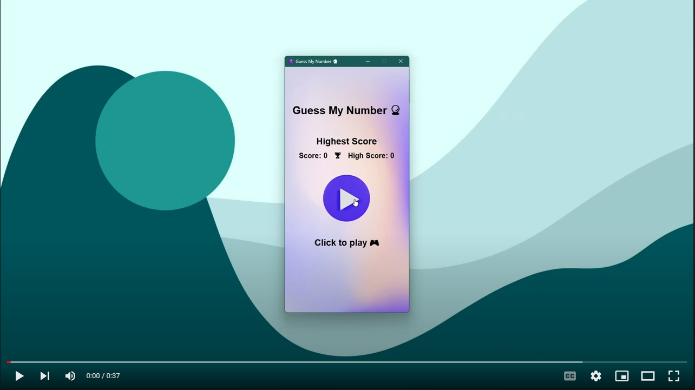
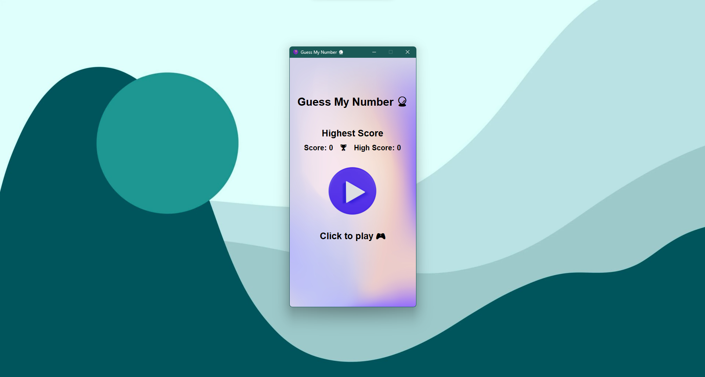
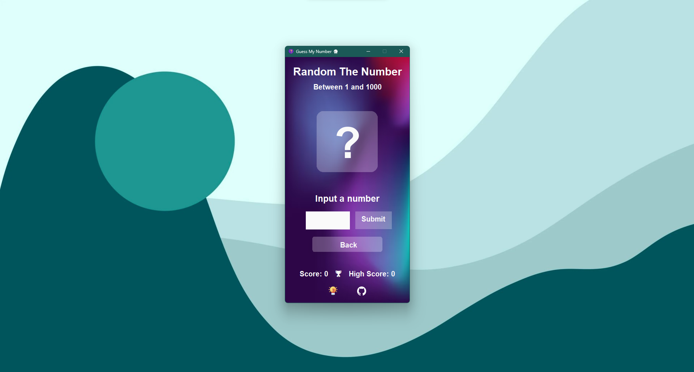
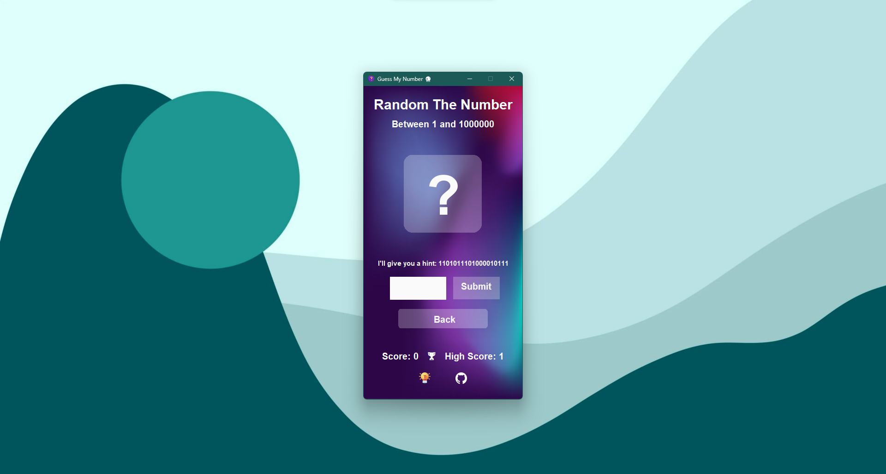
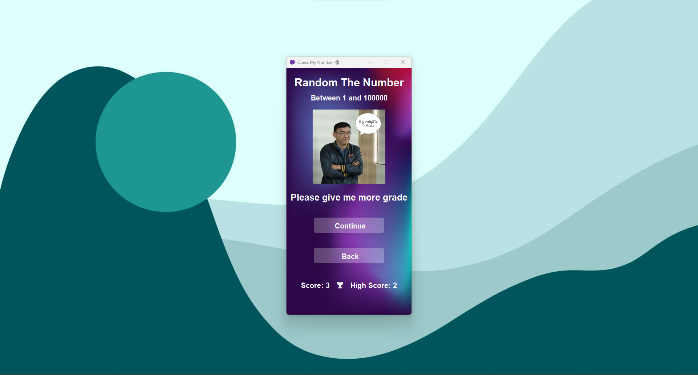

# Guess My Number 🔮


## Analytics Contributions


## Demo 🎥

[](https://user-images.githubusercontent.com/108584943/226904279-15160393-91f1-4758-9bf4-433d96c60d21.mp4)

<details>
    <summary>Click to see image</summary>
    
    
    
    
    
</details>

## About the project 📖

This is a simple game that you have to guess the number that the computer has chosen. The computer will give you a hint whether the number you have chosen is higher or lower than the number that the computer has chosen. The game will end when you guess the number correctly.

## Author 🙋‍♂️

- [Teachin Pongmanee (NongFeen)](https://github.com/NongFeen) 🧪💻🪲
- [Teeradon Numthong (custapq)](https://github.com/custapq) 🧪💻🤓🍷
- [Noppakorn Kaewsalabnil (PunGrumpy)](https://github.com/PunGrumpy) 💻🎨🚩

## Features 📌

- [x] Guess the number that the computer has chosen
- [x] The computer will give you a hint whether the number you have chosen is higher or lower than the number that the computer has chosen
- [x] Hint will be given in the form of a binary number
- [x] The game will end when you guess the number correctly
- [x] When you input the empty or string it not include easter egg, it will go to error page
- [x] Easter egg for fun

<details>
    <summary>Click to see Easter egg</summary>
    <h2>The easter egg fill in guess field</h2>
    <ul>
        <li>
            <h3><b>cheat</b></h3>
            <p>For see answer</p>
        </li>
        <li>
            <h3><b>I love Suntana<b></h3>
            <p>For show teacher picture and then you win</p>
            <p>⚠️ Case sensitive</p>
        </li>
    </ul>
</details>

## Built with 🛠

- [Java](https://www.java.com/en/) - Programming language
- [Maven](https://maven.apache.org/) - Dependency management
- [GitHub Actions](https://github.com/features/actions) - CI/CD

## Table of contents 🌳

```bash
├─── .github
│   └─── workflows
├─── src
│   └─── main
│   └─── utility
├─── .gitignore
├─── pom.xml
├─── LICENSE
└─── README.md
```

## Pre-requisites 📋

- [Java 19](https://www.oracle.com/java/technologies/downloads/) or higher
- [Maven 3.9.1](https://maven.apache.org/download.cgi) or higher

## Installation 🔧

```bash
# Clone the repository
git clone https://github.com/PunGrumpy/guess-my-number.git

# Go to the project directory
cd guess-my-number

# Build the project
mvn clean package

# Run the program
java -jar target/guess-my-number-[version].jar
```

## Contributing 🤝

1. Fork the project
2. Create your feature branch (`git checkout -b feat/AmazingFeature`)
3. Commit your changes (`git commit -m 'Add some AmazingFeature'`)
4. Push to the branch (`git push origin feat/AmazingFeature`)
5. Open a pull request

---

You can create your own **`GUESS MY NUMBER`** game for free without notifying me by forking this project under the following conditions:

- Don't use UI design from this project 🎨
- Add credit for this project in your project 📖